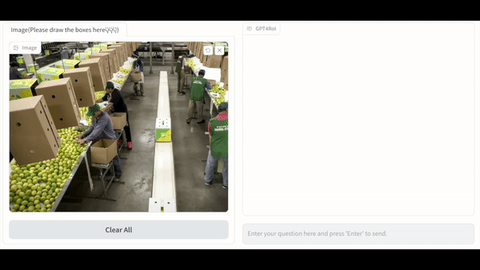
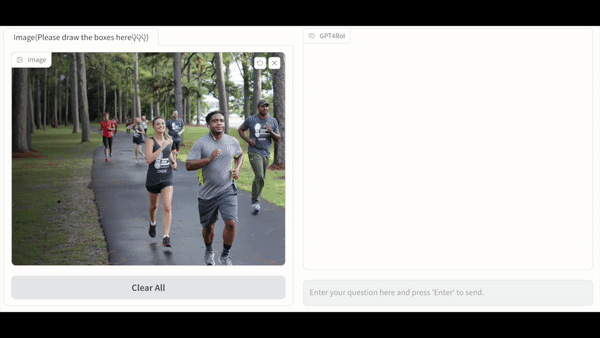
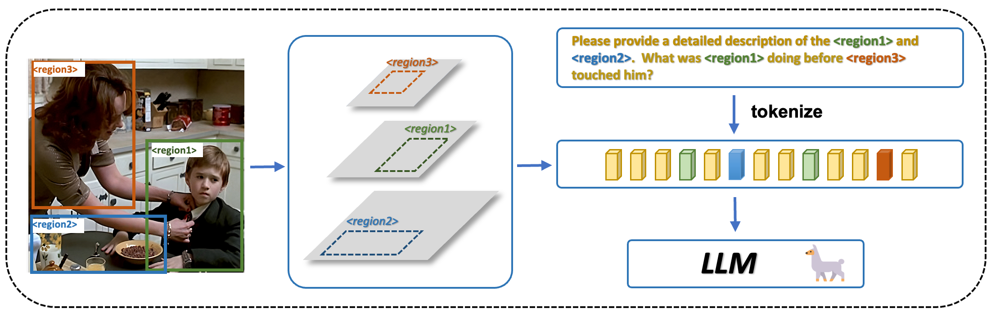

# GPT4RoI: Instruction Tuning Large Language Model on Region-of-Interest :fire: [Demo](http://139.196.83.164:7000/) :fire:


[//]: # (<div id="wrapper" align="center">)

[//]: # (<figure>)

[//]: # (  &emsp;)

[//]: # (  <br>)

[//]: # (  <p style="font-size:1.2vw;">Left: Single-Region Understanding; Right: Single-Region Understanding</p>)

[//]: # (</figure>)

[//]: # (</div>)


<p align="center">
     <br>
  <p align="center" style="font-size:1.2vw;">Single-Region Understanding</p>
</p>
<p align="center">
     <br>
  <p align="center"  style="font-size:1.2vw;">Multiple-Region Understanding</p>
</p>


## Introduction
<p align="center">
     <br>
</p>

> [**GPT4RoI: Instruction Tuning Large Language Model on Region-of-Interest**](https://arxiv.org/abs/2307.03601)               
> [Shilong Zhang*](https://jshilong.github.io/), [Peize Sun*](https://peizesun.github.io/), [Shoufa Chen*](https://www.shoufachen.com/), Min Xiao, Wenqi Shao ,Wenwei Zhang, Kai Chen, Ping Luo</br>
> (*Equal Contribution) 

### [[Demo](http://139.196.83.164:7000/)]  [[Paper](https://arxiv.org/abs/2307.03601)] [[中文介绍](https://zhuanlan.zhihu.com/p/640283103)]

[//]: # (#:grin::grin::grin:信交流群：xxx &#40;答案：cheems&#41;)


## Updates

- [July 25]  [GPT4RoI-7B-delta-V0](https://huggingface.co/shilongz/GPT4RoI-7B-delta-V0) has release ! :fire::fire::fire: You need to combine our delta with the original LLaMA weights follow the [GPT4RoI Weights](Weights). 
- [July 7]  All training and inference code has been released, you can try demo [here](http://139.196.83.164:7000/) :fire::fire::fire:


## Contents
- [Install](#Install)
- [Data](#Data)
- [GPT4RoI Weights](Weights)
- [Training](#Training)
- [Gradio](#Gradio)
- [Acknowledge](#Acknowledge)


## Install
1. Clone the `GPT4RoI`
```python
git clone https://github.com/jshilong/gpt4roi.git
cd gpt4roi
```

2. Create the env
```shell
conda create -n gpt4roi python=3.10 -y
conda activate gpt4roi
pip install --upgrade pip  # enable PEP 660 support
pip install setuptools_scm
pip install --no-cache-dir  -e .
# please use conda re-install the torch, pip may loss some runtime lib
conda install pytorch torchvision torchaudio pytorch-cuda=11.7 -c pytorch -c nvidia 
```
3. Install the `flash-attn` package 
```
pip install ninja
pip install flash-attn --no-build-isolation
```
4. install the `mmcv-1.4.7` package
Make sure that your `nvcc -V` is consistent with cudatookit version of `python -c "import torch;print(torch.version.cuda)`.
```shell
cd mmcv-1.4.7
MMCV_WITH_OPS=1 pip install -e .
```

<!-- ## Data Preparation

| Data file name | Size | original from|
| --- | --- | ---|
| [single_region_caption.json](https://huggingface.co/datasets/liuhaotian/LLaVA-Instruct-150K/raw/main/llava_instruct_150k.json) | 229 MB | VC, Refcocog |
| [multi_region_caption.json](https://huggingface.co/datasets/liuhaotian/LLaVA-Instruct-150K/raw/main/llava_instruct_80k.json) | 229 MB | flicker30k |
| [spation-instruction21k.json](https://huggingface.co/datasets/liuhaotian/LLaVA-Instruct-150K/raw/main/conversation_58k.json) | 126 MB | VCR |


We also use langauge-image multimodal instruction-folllowing dataset [`LLaVA-Instruct-150K`](https://huggingface.co/datasets/liuhaotian/LLaVA-Instruct-150K),  with we detect objects with EVA-lvis model, you should download the  ``eva_lvis_coco.pkl`` when you use this dataset. -->

## Data

Our dataset includes RefCOCO, RefCOCO+, RefCOCOg, Visual Genome, Flickr30K entities, and the VCR dataset. We are sincerely grateful to the creators of these datasets, especially for the VCR dataset, for their forward-thinking in creating these dataset.

The dataset section of this repository may appear somewhat messy, especially the VCR part(still finishing), which may cause GPT4RoI not be very user-friendly. We are currently working on formulating the datasets into a unified format and will be accompanying them with stronger models. Please stay tuned for updates.


You can download the corresponding dataset from the official website and organize it as follows. Afterwards, you can modify the ```gpt4roi/configs/dataset_config.json``` file to select the specific dataset you want to use:

```text
GPT4RoI
├── data
│   ├── coco_det
│   │   ├── annotations
│   │   │      ├──instances_train2017.json
│   │   ├── train2017/
│   ├── mdetr_annotations
│   │          ├──finetune_refcoco_train.json
│   │          ├──finetune_refcoco+_train.json
│   │          ├──finetune_refcocog_train.json
│   │          ├──final_flickr_mergedGT_train.json
│   ├── coco_imgs/
│   ├── flickr30k-images/
│   ├── visual_genome
│   │          ├──train.json
│   │          ├──vg_all/
│   ├── llava
│   │   ├── llava_instruct_150k.json
│   │   ├── llava_150k_bbox_pred_results.pkl
│   ├── vcr
│   │   ├── train.jsonl
│   │   ├── vcr1images/
```
### NOTE
1. coco_imgs should contains all coco image(you can soft link them to this directory.
2. We use Visual_Genome_Dataset_V1.2, available for download from  [OpenDataLab](https://opendatalab.com/). Ensure to download the  [train.json](https://datarelease.blob.core.windows.net/grit/VG_preprocessed_annotations/train.json), you should create a soft link for all VG images to the directory `vg_all`.
3. [llava_150k_bbox_pred_results.pkl](https://huggingface.co/shilongz/temp/tree/main) contains the detection predicted results with EVA-02-DET. We appreciate their work.


## Weights
Due to the licensing restrictions of LLaMA, the delta weights GPT4RoI-7B is produced from LLaMA-7B. To acquire the GPT4RoI weights, you need to combine our delta with the original LLaMA weights.

### Step1. Download the original LLaMA-7B weights
The original LLaMA weights are available for download. Use the following commands:
```shell
git lfs install
git clone https://huggingface.co/decapoda-research/llama-7b-hf ./llama-7b 
```

Alternatively, access the [webpage](https://huggingface.co/decapoda-research/llama-7b-hf/tree/main) to download the file.

### Step2. Download the delta weights of GPT4RoI-7B

The delta weights for GPT4RoI-7B can be downloaded using the following commands:
```shell
git lfs install
git clone https://huggingface.co/shilongz/GPT4RoI-7B-delta-V0 ./GPT4RoI-7B-delta
```
You can also directly download the file from this [webpage](https://huggingface.co/shilongz/GPT4RoI-7B-delta-V0/tree/main).

### Step3. Apply the delta weights to the original LLaMA-7B weights
Apply the delta weights to the original LLaMA-7B weights. Note that this conversion command requires approximately 30 GB of CPU RAM.
```bash
python3 -m scripts.apply_delta.py \
    --base ./llama-7b \
    --target ./GPT4RoI-7B \
    --delta ./GPT4RoI-7B-delta
```

## Training
GPT4RoI is trained on 8 A100 with the following code.

### STAGE 1
Vicuna-v0, an instruction-tuned chatbot, is the base model for this setup. In order to prepare it, first download the delta weights available [here](https://huggingface.co/lmsys/vicuna-7b-delta-v0). To obtain the original weights, follow the instructions provided [here](https://github.com/lm-sys/FastChat/blob/main/docs/vicuna_weights_version.md#how-to-apply-delta-weights-for-weights-v11-and-v0) to integrate these delta weights into LLaMA-7B.

Ensure to download the following projector weight file: [LLaVA-7b-pretrain-projector-v0-CC3M-595K-original_caption.bin](https://huggingface.co/liuhaotian/LLaVA-Pretrained-Projectors/resolve/main/LLaVA-7b-pretrain-projector-v0-CC3M-595K-original_caption.bin).

Additionally, you have the flexibility to choose from different versions of Vicuna (such as the 13B version or llama v2 chatbot) and the corresponding projector weights from [LLaVA](https://github.com/haotian-liu/LLaVA) to meet your specific requirements effectively.
`exp/stage1` is the work directory. 
```Shell
bash train_stage1.sh exp/stage1
# Resume training in stage1
# bash train_stage1.sh exp/stage1

```
`exp/stage2` is the work directory. and you should give the work directory of stage1 so we can load the corresponding weight as pretrain model.
```Shell
# At the beginning of stage2
bash train_stage2.sh exp/stage2 exp/stage1
# Resume training in stage2
# bash train_stage2.sh exp/stage2 
```


## Gradio
Please install [Gradio Box](https://github.com/ShoufaChen/gradio-dev) first.
```python
python gpt4roi/app.py
```
### NOTES
1. ```prompt format in GPT4RoI```
You should always use `<region1>, <region2>...` to refer the new bounding box in the image when you first draw them. Then you can use normal `region 1` in the conversation to refer the instance.
2. You should always click the `clear all` buttul and waiting the clear process finished before you start a new conversation.

<p align="center">
     <br>
<p align="center"  style="font-size:1.2vw;">Multiple Rounds of Dialogue</p>
</p>


## Acknowledge

- [LLaVA](https://github.com/haotian-liu/LLaVA): The codebase we built upon.
- [Vicuna](https://github.com/lm-sys/FastChat): The LLM we used.
- [VCR](https://visualcommonsense.com/): We get strong region reasoning ability from this forward thinking dataset.

If you find GPT4RoI useful for your your research and applications, please cite using this BibTeX:
```bibtex
@misc{zhang2023gpt4roi,
      title={GPT4RoI: Instruction Tuning Large Language Model on Region-of-Interest}, 
      author={Shilong Zhang and Peize Sun and Shoufa Chen and Min Xiao and Wenqi Shao and Wenwei Zhang and Kai Chen and Ping Luo},
      year={2023},
      eprint={2307.03601},
      archivePrefix={arXiv},
      primaryClass={cs.CV}
}
```
